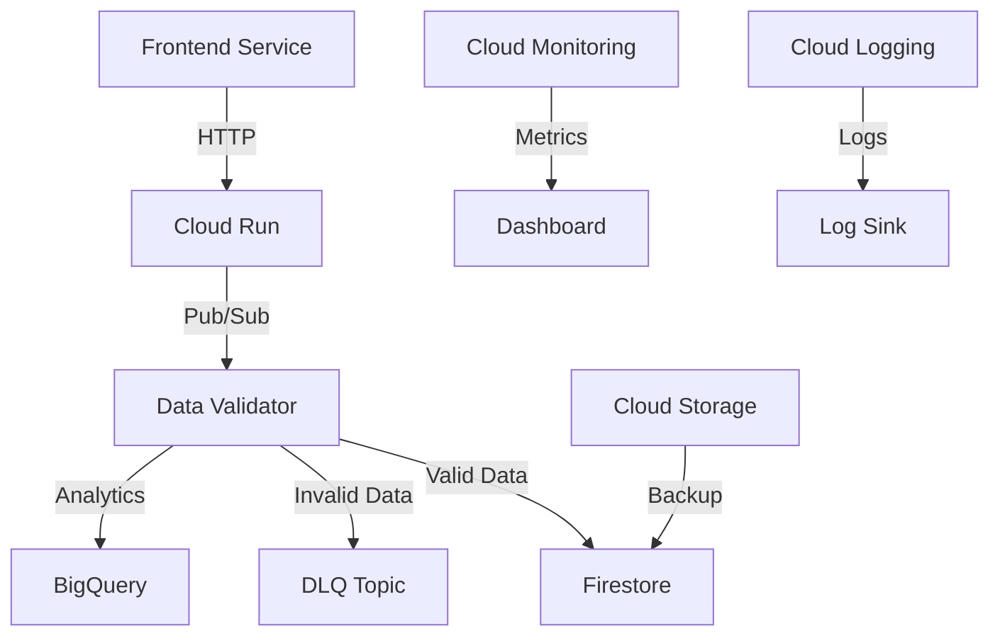

# Architecture Documentation

## System Overview
The Serverless Pipeline is a cloud-native application built on Google Cloud Platform (GCP) that processes and validates data in a serverless environment.

## Architecture Diagram

## Components

### 1. Frontend Service (Cloud Run)
- **Purpose**: User interface for data submission
- **Technology**: Python/Flask
- **Features**:
  - Data input form
  - Real-time validation
  - Error handling
  - Responsive design

### 2. Data Validator (Cloud Function)
- **Purpose**: Validates and processes incoming data
- **Technology**: Python
- **Features**:
  - Schema validation
  - Data transformation
  - Error handling
  - Dead letter queue integration

### 3. Data Storage
#### Firestore
- **Purpose**: Primary data storage
- **Features**:
  - Document-based storage
  - Real-time updates
  - Automatic scaling

#### BigQuery
- **Purpose**: Analytics and reporting
- **Features**:
  - Data warehousing
  - SQL queries
  - Data visualization

#### Cloud Storage
- **Purpose**: Backup and file storage
- **Features**:
  - Object storage
  - Versioning
  - Lifecycle management

### 4. Message Queue (Pub/Sub)
- **Purpose**: Asynchronous communication
- **Components**:
  - Main topic: `events-topic`
  - DLQ topic: `events-topic-dlq`
  - Subscriptions with retry policies

### 5. Monitoring and Logging
- **Components**:
  - Cloud Monitoring
  - Cloud Logging
  - Custom metrics
  - Alerting policies

## Data Flow
1. User submits data through frontend
2. Frontend service validates basic format
3. Data sent to Cloud Function via Pub/Sub
4. Cloud Function performs detailed validation
5. Valid data stored in Firestore
6. Invalid data sent to DLQ
7. Analytics data exported to BigQuery
8. Logs and metrics collected for monitoring

## Security
- IAM roles and permissions
- Service account authentication
- Network security
- Data encryption at rest and in transit

## Scalability
- Automatic scaling of Cloud Run
- Pub/Sub message queuing
- Firestore automatic scaling
- BigQuery serverless processing

## Reliability
- Dead letter queue for error handling
- Retry mechanisms
- Data backup and recovery
- Monitoring and alerting

## Cost Optimization
- Serverless components
- Pay-per-use pricing
- Automatic scaling
- Resource optimization

## Development Workflow
1. Local development
2. Testing
3. Deployment
4. Monitoring
5. Maintenance

## Future Enhancements
1. Authentication and authorization
2. Advanced analytics
3. Machine learning integration
4. Multi-region deployment
5. CI/CD pipeline 